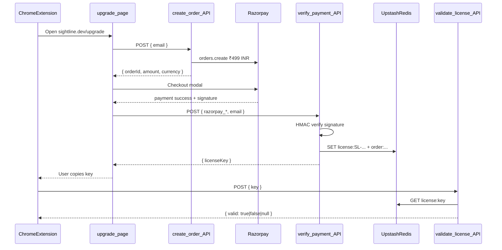

# Payment Integration Context

> Maintainer doc for the Sightline payment + license flow.
> Last updated: July 2026

## Overview

Sightline Pro is sold via **Razorpay** on `sightline.dev/upgrade`. After payment, the server issues a **license key** (`SL-{UUID}`) stored in **Upstash Redis**. The Chrome extension validates keys against `/api/validate-license`.

There is **no user auth** on the website — Pro status lives entirely in the extension via `chrome.storage.local`.

## Flow

## Files

| File | Role |
|------|------|
| [`src/app/upgrade/page.jsx`](../src/app/upgrade/page.jsx) | Client checkout UI — email → Razorpay → show license key |
| [`src/app/upgrade/layout.tsx`](../src/app/upgrade/layout.tsx) | Minimal layout (no site header/footer), `noindex` metadata |
| [`src/app/api/create-order/route.js`](../src/app/api/create-order/route.js) | Creates Razorpay order (₹499 = 49900 paise, INR) |
| [`src/app/api/verify-payment/route.js`](../src/app/api/verify-payment/route.js) | Verifies HMAC, generates `SL-` key, stores in Redis (idempotent per order) |
| [`src/app/api/validate-license/route.js`](../src/app/api/validate-license/route.js) | Extension-facing validation; CORS enabled |
| [`src/lib/send-license-email.js`](../src/lib/send-license-email.js) | Sends license key via Resend after successful payment |
| [`src/lib/constants.ts`](../src/lib/constants.ts) | Pro tier CTA → `/upgrade` |

## Environment variables

Copy [`.env.example`](../../.env.example) to `.env.local` for local dev. Set the same in Vercel for production.

| Variable | Where used |
|----------|------------|
| `RAZORPAY_KEY_ID` | Server: `create-order` |
| `RAZORPAY_KEY_SECRET` | Server: `create-order`, `verify-payment` (HMAC) |
| `NEXT_PUBLIC_RAZORPAY_KEY_ID` | Client: Razorpay checkout on `/upgrade` |
| `UPSTASH_REDIS_REST_URL` | All license API routes |
| `UPSTASH_REDIS_REST_TOKEN` | All license API routes |
| `RESEND_API_KEY` | `send-license-email` (license key delivery) |
| `EMAIL_FROM` | Sender address for license emails (must be verified in Resend) |

## Redis schema

| Key | Value |
|-----|-------|
| `license:SL-{UUID}` | `{ email, orderId, paymentId, createdAt, valid: true }` |
| `order:{razorpay_order_id}` | License key string (idempotency) |

## Extension contract

The extension (separate repo / `extension/` folder) expects:

- **Upgrade entry:** `https://sightline.dev/upgrade`
- **Validate:** `POST /api/validate-license` with `{ key: "SL-..." }`
- **Response:** `{ valid: true }` \| `{ valid: false }` \| `{ valid: null }` (null = network/Redis error, use cached status)
- **Storage keys:** `sl_license_key`, `sl_license_status`, `sl_license_checked_at`
- **Revalidation:** every 24h via `licenseCheck()`

## Pricing notes

| Surface | Price shown |
|---------|-------------|
| Payment APIs + `/upgrade` | **₹499/mo** (INR, Razorpay) |
| Marketing `/pricing` (Plans.tsx) | INR list prices (₹499 Pro, etc.) |
| `constants.ts` Pro CTA | Links to `/upgrade` with ₹499 label |

Lifetime / Team tiers are **marketing placeholders** — only Pro monthly is implemented in code.

## Layout architecture

- [`src/app/layout.tsx`](../src/app/layout.tsx) — Root: Once UI CSS, ThemeInit, Providers (required for `/upgrade` outside `(main)`)
- [`src/app/(main)/layout.tsx`](../src/app/(main)/layout.tsx) — Marketing chrome: Header, Footer, background effects
- `/upgrade` intentionally has **no** header/footer (extension opens it directly)

## Not implemented (known gaps)

- [ ] Razorpay webhooks / subscription renewal
- [ ] Lifetime or Team checkout
- [ ] License revocation / admin panel
- [ ] Rate limiting on `validate-license`

## Local testing

1. `npm install` (includes `razorpay`, `@upstash/redis`)
2. Fill `.env.local` with Razorpay test keys + Upstash credentials
3. `npm run dev` → open `http://localhost:3000/upgrade`
4. Use Razorpay test card: `4111 1111 1111 1111`, any future expiry, any CVV
5. Copy the `SL-...` key and test in the extension activation flow

## Deployment checklist

- [ ] All 7 env vars set in Vercel
- [ ] Razorpay live keys for production domain
- [ ] Upstash Redis in same region as Vercel functions
- [ ] Extension `host_permissions` includes `https://sightline.dev/*`
